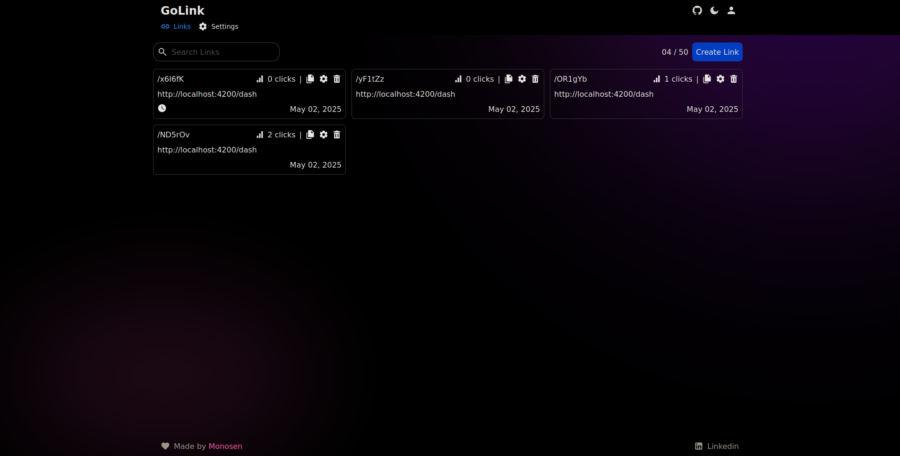

# GoLink

<div align="center">

</div>

<div align="center">
    <a href="https://golink.dev" target="_blank">
        Sitio Web
    </a>
    <span>&nbsp;•&nbsp;</span>
    <a href="#-tecnologías">
        Tecnologías
    </a>
    <span>&nbsp;•&nbsp;</span>
    <a href="#-contribuir">
        Contribuir
    </a>
    <span>&nbsp;•&nbsp;</span>
    <a href="https://twitter.com/golink">
        Twitter
    </a>
</div>

<div align="center">


</div>

## 📝 Descripción

GoLink es una aplicación web moderna para acortar URLs con características avanzadas:

- **Acortamiento de URLs**: Convierte URLs largas en enlaces cortos y fáciles de compartir
- **Control de Accesos**: Limita el número de clics permitidos para cada enlace
- **Enlaces Temporales**: Configura fechas de expiración para que los enlaces dejen de funcionar después de un tiempo determinado
- **Estadísticas**: Visualiza métricas de uso como número de clics, ubicaciones geográficas y dispositivos
- **Personalización**: Crea enlaces personalizados con alias únicos
- **Panel de Control**: Gestiona todos tus enlaces desde un dashboard intuitivo

## 🚀 Tecnologías

### Backend

- [**NestJS**](https://nestjs.com/) - Framework progresivo de Node.js para construir aplicaciones del lado del servidor
- [**PostgreSQL**](https://www.postgresql.org/) - Base de datos relacional robusta
- [**JWT**](https://jwt.io/) - Autenticación y autorización
- [**Docker Compose**](https://docs.docker.com/compose/) - Orquestación de contenedores
- [**Prisma**](https://www.prisma.io/) - ORM moderno para TypeScript y Node.js

### Frontend

- [**Angular**](https://angular.io/) - Framework para aplicaciones web
- [**TailwindCSS**](https://tailwindcss.com/) - Framework CSS utilitario
- [**Iconify**](https://iconify.design/) - Framework de iconos unificados

## 🛠️ Contribuir

1. [Fork](https://github.com/monosen/golink/fork) el repositorio

2. Instala las dependencias:

```bash
# Backend
cd apps/api
pnpm install

# Frontend
cd apps/web
pnpm install
```

3. Ejecuta los servidores de desarrollo:

```bash
# Backend (desde la carpeta backend)
pnpm run start:dev

# Frontend (desde la carpeta frontend)
ng serve
```

Abre [http://localhost:4200](http://localhost:4200) para el frontend y [http://localhost:3000](http://localhost:3000) para el backend API ✨.

## 📄 Licencia

- [**GPL-3.0 License**](LICENCE)
